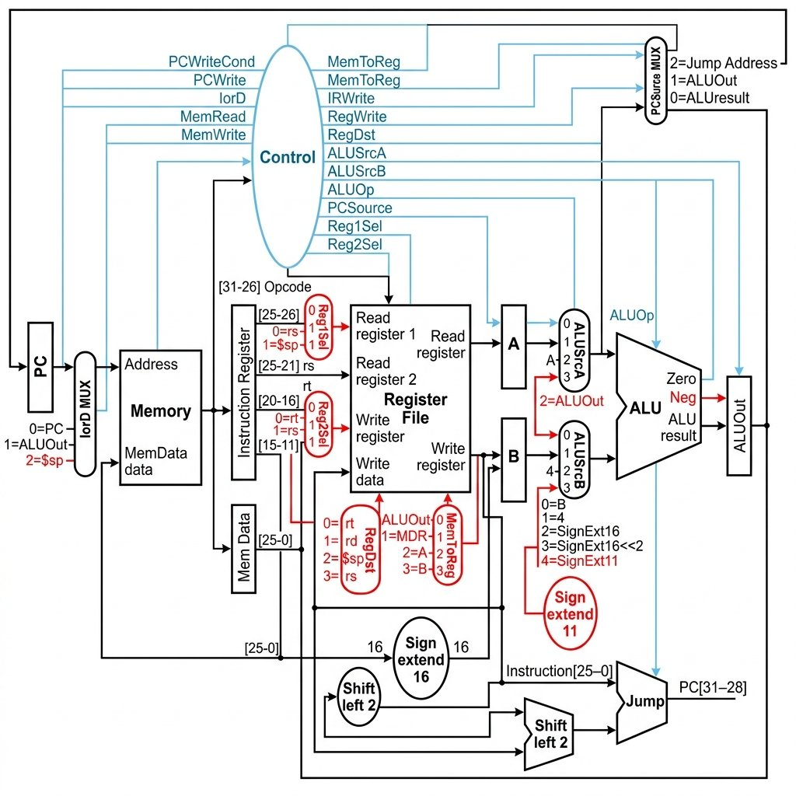
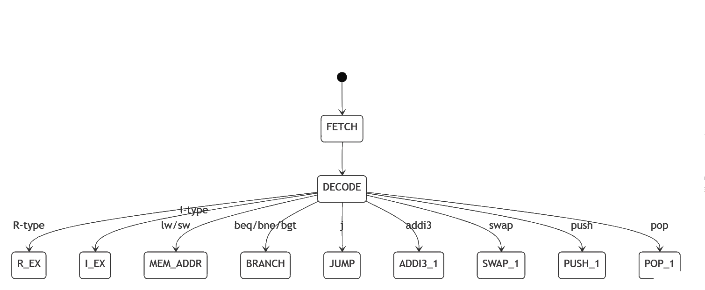
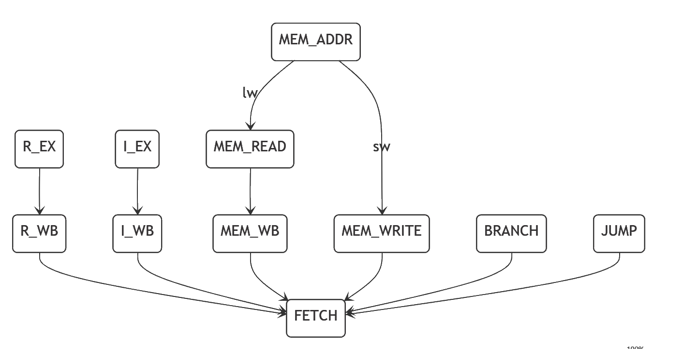
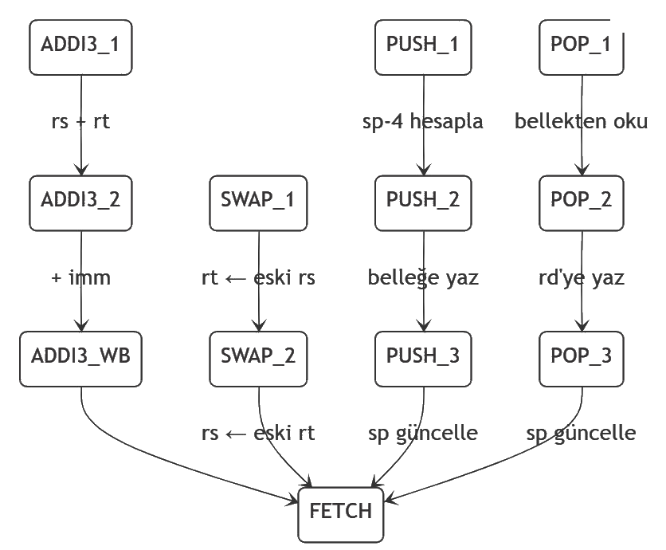
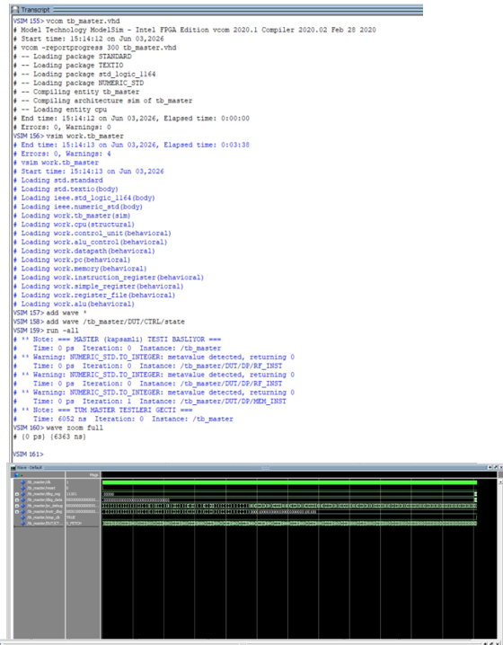

# Çok Çevrimli (Multi-Cycle) MIPS İşlemci

VHDL ile tasarlanmış, sonlu durum makinesi (FSM) tarafından denetlenen **çok çevrimli MIPS işlemci**. Standart MIPS komut kümesine ek olarak **7 özel komut** (`mul`, `swap`, `loadi`, `bgt`, `push`, `pop`, `addi3`) ile genişletilmiştir. Projeye ait iki geçişli bir **Python assembler** ve 13 adet **kendi kendini denetleyen (self-checking) testbench** de dâhildir.

> İstanbul Üniversitesi-Cerrahpaşa · Bilgisayar Mühendisliği · Bilgisayar Mimarisi Dönem Projesi

---

## İçindekiler
- [Özellikler](#özellikler)
- [Mimari](#mimari)
- [Komut Kümesi](#komut-kümesi)
- [Dizin Yapısı](#dizin-yapısı)
- [Assembler Kullanımı](#assembler-kullanımı)
- [ModelSim ile Derleme ve Test](#modelsim-ile-derleme-ve-test)
- [Testbench'ler](#testbenchler)
- [Takım](#takım)

---

## Özellikler

- **Çok çevrimli veri yolu:** Tek ALU ve tek bellek, MUX'larla yeniden kullanılır (IF → ID → EX → MEM → WB).
- **23 durumlu FSM:** İki süreçli (two-process) denetim birimi; her komut tipi 3–5 çevrim arasında çalışır.
- **23 komut:** 16 standart MIPS + 7 özel komut.
- **256 × 32-bit** Von Neumann bellek (komut + veri aynı uzayda).
- **İşaretli (signed) ALU:** `add`, `sub`, `slt`, `mul` işaretli; `zero` ve `neg` bayrakları FSM dallanma kararlarında kullanılır.
- **Donanımsal yığın:** `$sp` ($29) üzerinden `push`/`pop`; register-file zamanlamasıyla geçici register'sız `swap`.
- **VHDL-2008**, ModelSim Intel FPGA Edition üzerinde doğrulandı.

---

## Mimari

```
       ┌──────────────────── Control Unit (FSM, 23 durum) ────────────────────┐
       │  pc_write, ir_write, reg_write, mem_read/write, ior_d, mem_to_reg,    │
       │  reg_dst, alu_src_a, alu_src_b, pc_source, alu_op   (durum → sinyal)  │
       └──────────────────────────────────────────────────────────────────────┘
   PC → Memory → Instruction Register → Register File → A/B → ALU → ALUOut → ...
         (tek bellek, IorD MUX ile komut/veri paylaşımı; tek ALU yeniden kullanılır)
```

### Veri Yolu (Datapath)

Siyah bileşenler standart MIPS datapath'i, **kırmızı** ile vurgulananlar bu proje kapsamında 7 özel komut için eklenen birim ve yolları gösterir (`Reg1Sel`/`Reg2Sel` MUX, `IorD=$sp`, `RegDst=$sp`, ALUOut geri besleme, `SignExt11`).



- **Veri yolu** standart Patterson–Hennessy çok çevrimli MIPS datapath'i temel alır; 7 özel komut için eklenen yollar: `Reg1Sel`/`Reg2Sel` MUX (yığın için `$sp` seçimi), `IorD=$sp`, `RegDst=$sp`, ALUOut geri besleme (`addi3`), 11-bit işaret genişletme (`signext11`).
- **`alu_control`** 2-bit `alu_op` ile çalışır: `00`=ADD zorla, `01`=SUB zorla, `10`=opcode/funct'tan çöz.
- **Dallanma koşulları** denetimde `zero`/`neg` ile: `beq = zero`, `bne = not zero`, `bgt = (not zero) and (not neg)`.

> **Tasarım notu (anlık değer):** Bu tasarımda tüm I-type komutlar (`andi`/`ori`/`xori` dâhil) tek bir 16-bit **işaret genişletme** yolu kullanır. Standart MIPS'te mantıksal komutlar sıfır-genişletir; donanımı sadeleştirmek için işaret-genişletme tercih edilmiştir. Fark yalnızca en yüksek biti 1 olan anlık değerlerde ortaya çıkar.

### Denetim Birimi (FSM, 23 durum)

**Getirme ve çözme:** `FETCH → DECODE` sonrası komut tipine göre ilgili yürütme durumuna dallanılır.



**Standart komutların tamamlanması:** R-type/I-type geri yazma (WB), `lw`/`sw` bellek erişimi, `branch`/`jump` doğrudan `FETCH`'e döner.



**Özel komutların durum geçişleri:** `addi3` iki ALU çevrimi sonrası yazar; `swap` iki ardışık yazmayla takası tamamlar; `push`/`pop` adres → bellek → `$sp` adımlarını izler.



---

## Komut Kümesi

**R-type** (opcode `0x00`, komut `funct` alanıyla belirlenir):

| Komut | funct | Açıklama |
|-------|-------|----------|
| `add`  | 0x20 | rd = rs + rt |
| `sub`  | 0x22 | rd = rs − rt |
| `and`  | 0x24 | rd = rs & rt |
| `or`   | 0x25 | rd = rs \| rt |
| `xor`  | 0x26 | rd = rs ^ rt |
| `slt`  | 0x2a | rd = (rs < rt) ? 1 : 0 (işaretli) |
| `mul`  | 0x2c | rd = rs * rt *(özel)* |
| `swap` | 0x2d | rs ↔ rt (2 çevrim, geçici register'sız) *(özel)* |

**I-type** (opcode):

| Komut | opcode | Açıklama |
|-------|--------|----------|
| `addi`  | 0x08 | rt = rs + signext(imm) |
| `slti`  | 0x0a | rt = (rs < signext(imm)) ? 1 : 0 |
| `andi`  | 0x0c | rt = rs & signext(imm) |
| `ori`   | 0x0d | rt = rs \| signext(imm) |
| `xori`  | 0x0e | rt = rs ^ signext(imm) |
| `lw`    | 0x23 | rt = MEM[rs + signext(imm)] |
| `sw`    | 0x2b | MEM[rs + signext(imm)] = rt |
| `beq`   | 0x04 | rs == rt ise dallan |
| `bne`   | 0x05 | rs != rt ise dallan |
| `loadi` | 0x11 | rt = imm16 *(özel)* |
| `bgt`   | 0x12 | rs > rt ise dallan *(özel)* |
| `push`  | 0x13 | $sp −= 4; MEM[$sp] = rs *(özel)* |
| `pop`   | 0x14 | rt = MEM[$sp]; $sp += 4 *(özel)* |

**J-type / özel format:**

| Komut | opcode | Açıklama |
|-------|--------|----------|
| `j`     | 0x02 | PC = jump_addr |
| `addi3` | 0x10 | rd = rs + rt + imm11 (2 ALU çevrimi) *(özel)* |

> Toplam **23 komut** — 7'si bu proje kapsamında eklenen özel komutlardır (`mul`, `swap`, `loadi`, `bgt`, `push`, `pop`, `addi3`).

---

## Dizin Yapısı

```
.
├── src/                     # VHDL kaynak modülleri
│   ├── alu.vhd              # 7 işlemli işaretli ALU (zero/neg bayrakları)
│   ├── alu_control.vhd      # alu_op → alu_ctrl çözümü
│   ├── control_unit.vhd     # FSM tabanlı denetim (23 durum)
│   ├── datapath.vhd         # tüm modülleri MUX'larla bağlar
│   ├── cpu.vhd              # üst seviye (datapath + control + alu_control)
│   ├── pc.vhd               # program sayacı
│   ├── instruction_register.vhd
│   ├── register_file.vhd    # 32×32-bit, $0 sabit, debug okuma portu
│   ├── memory.vhd           # 256×32-bit Von Neumann bellek
│   └── simple_register.vhd  # genel amaçlı yazmaç (A/B/ALUOut/MDR)
│
├── assembler/
│   └── assembler.py         # iki geçişli Python assembler (.asm → .hex)
│
├── programs/                # örnek assembly programları + derlenmiş .hex
│   ├── test_master.asm/.hex     # kapsamlı senaryo (dizi + döngü + yığın)
│   ├── test_edge.asm/.hex       # uç durumlar
│   ├── test_boundary.asm/.hex   # sınır durumları (overflow, bellek sınırı)
│   ├── test_itype.asm/.hex      # slti/andi/ori/xori
│   ├── test_stack.asm/.hex      # push/pop/swap
│   └── ...
│
└── testbench/               # 13 kendi kendini denetleyen testbench
```

---

## Assembler Kullanımı

İki geçişli assembler bir `.asm` dosyasını ModelSim'in `readmemh` formatında bir `.hex` dosyasına çevirir:

```bash
python3 assembler/assembler.py programs/test_master.asm programs/test_master.hex
```

- Etiketleri (label) ve `$t0`, `$sp` gibi register takma adlarını çözer.
- Anlık değerler decimal (`42`, `-5`) veya hex (`0xFF`) olabilir.
- Çıktı her satırda bir 32-bit komutun 8 haneli hex hâlidir.

---

## ModelSim ile Derleme ve Test

> **Önemli:** Derleme bağımlılık sırasına uyulmalıdır (yaprak modüller → datapath → cpu → testbench). Ayrıca ilgili `.hex` dosyası, `vsim`'in çalıştığı klasörde bulunmalıdır.

```tcl
# 1) Kaynakları derle (bağımlılık sırasıyla)
vcom -2008 alu.vhd memory.vhd pc.vhd simple_register.vhd \
           instruction_register.vhd register_file.vhd \
           alu_control.vhd control_unit.vhd datapath.vhd cpu.vhd

# 2) Bir testbench'i derle ve çalıştır
vcom -2008 tb_master.vhd
vsim work.tb_master
run -all
```

**Geçme ölçütü:** Çıktıda hiç `** Error` satırı bulunmaması. (Testbench'ler `assert ... severity error` kullanır; bu simülasyonu durdurmaz, dolayısıyla geçme kanıtı hata satırlarının *yokluğu*dur.)

> `Recompile work.<modül> because it has changed` hatası alırsanız tüm dosyaları yukarıdaki sırayla yeniden derleyin.

---

## Testbench'ler

**Yapı taşı / birim testleri (8):**
`tb_alu`, `tb_alu_control`, `tb_pc`, `tb_simple_register`, `tb_instruction_register`, `tb_register_file`, `tb_memory`, `tb_cpu`

**Program / senaryo testleri (5):**

| Testbench | Kapsam |
|-----------|--------|
| `tb_itype`    | `slti` / `andi` / `ori` / `xori` |
| `tb_stack`    | `push` / `pop` / `swap` (LIFO) |
| `tb_boundary` | 32-bit overflow, bellek sınırı (word 255), ileri dallanma |
| `tb_edge`     | $0 koruması, negatif immediate, işaretli aritmetik, iç içe yığın |
| `tb_master`   | Dizi + toplam/maksimum döngüsü + tüm komutlar (bütünleşme) |

`tb_master` bütünleşme testinin ModelSim dalga biçimi (reset sonrası PC sıfırdan başlar, her komut doğru çevrim sayısında ilerler, 18 register doğrulanır — hata yok):



---

## Takım

| Öğrenci | No | Sorumluluk Alanı |
|---------|-----|------------------|
| Arda AYDIN | 1306230121 | Datapath Tasarımı |
| Mehmet BAL | 1306220020 | Entegrasyon & Dokümantasyon |
| Melih Can İÇÖZ | 1306220042 | Komut seti ve assembler geliştirme |
| Abdullah Taha ÜSTÜNSOY | 1306230117 | Test ve Doğrulama |
| Ahmet Melih ÜSTÜNER | 1306230119 | Kontrol Birimi Tasarımı |
